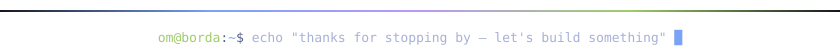

<!-- ============ TERMINAL HEADER (typing SVG) ============ -->

  
  
  

<!-- ============ ASCII PORTRAIT + ABOUT (self-generated, self-hosted in this repo) ============ -->

  
  

<!-- ============ TECH STACK ============ -->
### `~/stack`

  
  
  
  
  
  
  
  
  
  

LLMs · RAG · LangGraph · Agentic AI · Vector Search · Embeddings · Fine-tuning / LoRA · Computer Vision · Recommender Systems · MLOps

<!-- ============ FEATURED WORK ============ -->
### `~/featured-work`

| Project | What it does | Stack |
|---|---|---|
| [medical-image-xai-and-model-compression](https://github.com/omborda2002/medical-image-xai-and-model-compression) | Explainable AI + model compression for medical imaging | `PyTorch` `XAI` |
| [uav-waterfowl-detection](https://github.com/omborda2002/uav-waterfowl-detection) | Waterfowl detection in UAV drone imagery | `Computer Vision` |
| [blackjack](https://github.com/omborda2002/blackjack) | RL agent that learns optimal Blackjack strategy | `Python` `RL` |
| [anschreibenLLM](https://github.com/omborda2002/anschreibenLLM) | LLM-assisted German cover-letter generation | `Python` `LLM` |

<!-- ============ STATS ============ -->
### `~/stats`

<!-- SELF-HOSTED CARDS — uncomment once ghstats.showdata.online is live:

 

-->

<!-- ============ CONTRIBUTION SNAKE ============ -->

  

